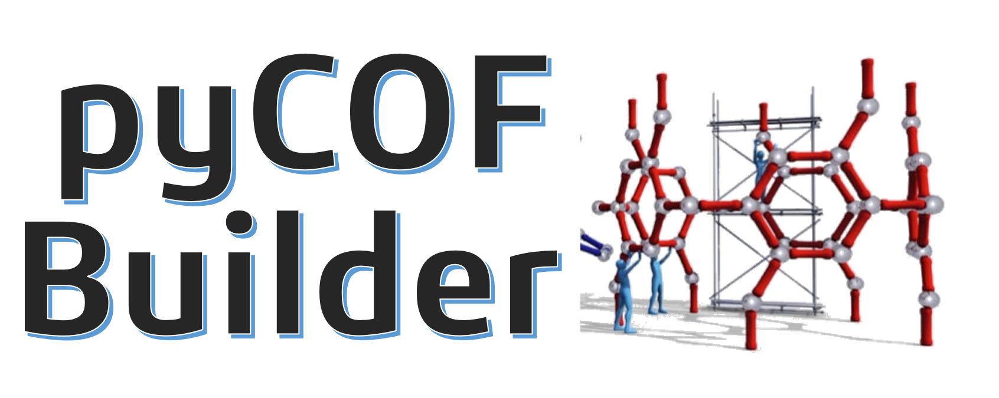

# pyCOFBuilder



**pyCOFBuilder** is a simple and powerful python package to automatically assembly COF structures with specifics building blocks, topologies, and functionalizations. The project was developed to address the need for generation of COFs structures in a high-throughput style, based on a nomenclature tha allows direct sctructural feature interpretation from a simple name. The package uses[pymatgen](https://pymatgen.org/) to create the structures. The package is still under development, but it is already possible to create a large number of COFs structures.

Learn more at [ToNano&Beyond](https://tonanoandbeyondblog.wordpress.com/)

## Installation

For detailed instructions see the [installation instructions](https://tonanoandbeyondblog.wordpress.com/).
If the requirements are already satisfied `[WILL BE UPDATED!!!!]`

```bash
pip install pycofbuilder
```

### Requirements

0. Python >= 3.7
1. pymatgen >= 2022.0.0
2. numpy >= 1.2
3. scipy >= 1.6.3
4. simplejson
5. tqdm

The Python dependencies are most easily satisfied using a conda
([anaconda](https://www.anaconda.com/distribution)/[miniconda](https://docs.conda.io/en/latest/miniconda.html))
installation by running

## Basic Usage

To create a specific COF, like `C3_BENZ_CHO_OH-C2_HDZ_NH2-HCB_A-AA`:

```python
>>> import pycofbuilder as COF

>>> c = COF.build('C3_BENZ_CHO_OH-C2_HDZ_NH2-HCB_A-AA')
C3_BENZ_CHO_OH-C2_HDZ_NH2-HCB_A-AA                            hexagonal   P    P6/m # 175    12 sym. op.
```

A `.cif` file (the default save format is CIF, but it can be easily changed) will be created in the `out` folder. The code will print out some information about the structure created.

Besides, the variable `c` now is a list with two elements. The first element is a Boolean value indicating whether the network creation was successful and the second element is the name of the created network. This information can be useful for workflows for creating multiple structures.

## Manual cration of a Reticular Object

It is possible to manually create a `Reticular` object:

```python
Ret = COF.Reticulum(out_dir=os.getcwd(), verbosity=True)

simm_data = Ret.create_hcb_a_structure('C3_BENZ_CHO_OH',
                                       'C2_DBPL_NH2_CH3_H_H_H',
                                       stacking='AA',
                                       bond_atom='N',
                                       print_result=True)

Ret.save_cif([1, 1, 2])
```

This code will create a COF with the name `C3_BENZ_CHO_OH-C2_DBPL_NH2_CH3_H_H_H-HCB_A-AA` and save it in the current directory. The code will print out some information about the structure created.


## Creating multiple COFs

You can also create multiple building blocks and then construct all available COFs from the connection of those blocks.

```python
import pycofbuilder as COF

for BB1 in ['C3_BENZ_CHO_H', 'C3_BENZ_CHO_OH', 'C3_BENZ_CHO_CH3', 'C3_BENZ_CHO_F']:
    COF.Building_Block(BB1)

for BB2 in ['C2_BENZ_NH2_H', 'C2_BENZ_NH2_OH', 'C2_BENZ_NH2_CH3', 'C2_BENZ_NH2_F']:
    COF.Building_Block(BB2)

COF.build_all_available_COFs()

```

You should see this output, where the code will calculate how many COFs will be created and ask for confirmation. Once you type `y` to confirm, a progress bar will indicate the creation of the structures as well as the estimated time for concluding the task. After the creation, the code will print some information about the COFs created, how many of the structures were created successfully, and the elapsed time.

```python
>>> 20 COFs will be created. Do you want to proceed? Type [y] to continue.
y
                      COF Name                              |    Lattice    | Point Group | N° of symmetry op. |
C3_BENZ_CHO_CH3-C2_BENZ_NH2_CH3_H-HCB_A-AA                    hexagonal   P     P6  # 168    6  sym. op.
C3_BENZ_CHO_CH3-C2_BENZ_NH2_F_H-HCB_A-AA                      hexagonal   P     P6  # 168    6  sym. op.
C3_BENZ_CHO_CH3-C2_BENZ_NH2_H_H-HCB_A-AA                      hexagonal   P     P6  # 168    6  sym. op.
C3_BENZ_CHO_CH3-C2_BENZ_NH2_OH_H-HCB_A-AA                     hexagonal   P     P6  # 168    6  sym. op.
C3_BENZ_CHO_CH3-C2_HDZ_NH2-HCB_A-AA                           hexagonal   P     P6  # 168    6  sym. op.
C3_BENZ_CHO_F-C2_BENZ_NH2_CH3_H-HCB_A-AA                      hexagonal   P     P6  # 168    6  sym. op.
C3_BENZ_CHO_F-C2_BENZ_NH2_F_H-HCB_A-AA                        hexagonal   P    P6/m # 175    12 sym. op.
C3_BENZ_CHO_F-C2_BENZ_NH2_H_H-HCB_A-AA                        hexagonal   P    P6/m # 175    12 sym. op.
C3_BENZ_CHO_F-C2_BENZ_NH2_OH_H-HCB_A-AA                       hexagonal   P    P6/m # 175    12 sym. op.
C3_BENZ_CHO_F-C2_HDZ_NH2-HCB_A-AA                             hexagonal   P    P6/m # 175    12 sym. op.
C3_BENZ_CHO_H-C2_BENZ_NH2_CH3_H-HCB_A-AA                      hexagonal   P     P6  # 168    6  sym. op.
C3_BENZ_CHO_H-C2_BENZ_NH2_F_H-HCB_A-AA                        hexagonal   P    P6/m # 175    12 sym. op.
C3_BENZ_CHO_H-C2_BENZ_NH2_H_H-HCB_A-AA                        hexagonal   P    P6/m # 175    12 sym. op.
C3_BENZ_CHO_H-C2_BENZ_NH2_OH_H-HCB_A-AA                       hexagonal   P    P6/m # 175    12 sym. op.
C3_BENZ_CHO_H-C2_HDZ_NH2-HCB_A-AA                             hexagonal   P    P6/m # 175    12 sym. op.
C3_BENZ_CHO_OH-C2_BENZ_NH2_CH3_H-HCB_A-AA                     hexagonal   P     P6  # 168    6  sym. op.
C3_BENZ_CHO_OH-C2_BENZ_NH2_F_H-HCB_A-AA                       hexagonal   P    P6/m # 175    12 sym. op.
C3_BENZ_CHO_OH-C2_BENZ_NH2_H_H-HCB_A-AA                       hexagonal   P    P6/m # 175    12 sym. op.
C3_BENZ_CHO_OH-C2_BENZ_NH2_OH_H-HCB_A-AA                      hexagonal   P    P6/m # 175    12 sym. op.
C3_BENZ_CHO_OH-C2_HDZ_NH2-HCB_A-AA                            hexagonal   P    P6/m # 175    12 sym. op.
20 sucessful. 0 failled (100.0 % success rate)
Enlapsed time: 1.476 s
```

All the structures created will be saved as `.cif` file on the `out`folder.  
Finally, it is possible to clean all the building blocks created

```python
>>> COF.clean_bb_list()
Deleted data\bb_lib\C2_BENZ_NH2_CH3_H.xyz
Deleted data\bb_lib\C2_BENZ_NH2_F_H.xyz
Deleted data\bb_lib\C2_BENZ_NH2_H_H.xyz
Deleted data\bb_lib\C2_BENZ_NH2_OH_H.xyz
Deleted data\bb_lib\C2_HDZ_NH2.xyz
Deleted data\bb_lib\C3_BENZ_CHO_CH3.xyz
Deleted data\bb_lib\C3_BENZ_CHO_F.xyz
Deleted data\bb_lib\C3_BENZ_CHO_H.xyz
Deleted data\bb_lib\C3_BENZ_CHO_OH.xyz
```

For more examples see _examples/_ and the [docs](https://github.com/lipelopesoliveira/pyCOFBuilder/examples.html)
for the complete explanation of implementation and functionalities.

## COFs and Building Blocks nomenclature

In order to ensure greater reproducibility as well as quickly and easily access to relevant information from the COFs, I've developed a simple nomenclature to name the structure. Generally speaking, a COF can be described as

### `Building_Block_1`-`Building_Block_2`-`Net`-`Stacking`

where:

- `Building_Block_1`: The building block with the greater connectivity.
- `Building_Block_2`: The building block with the smaller connectivity.
- `Net`: The net describing the reticular structure.
- `Stacking`: The stacking (for 2D structures) or interpenetrating degree (for 3D structures)

To name the building blocks I also developed a set of rules. The building block can be described as

### `Symmetry`\_`Core`\_`Connector`\_`RadicalGroupR1`\_`RadicalGroupR2`\_`RadicalGroupR3`\_`...`

where:

- `Symmetry`: The general symmetry of the building block. Also represents the connectivity of the building block. For 2D building blocks can be `C2`, `C3` or `C4`, and for 3D building blocks can be `D4`.
- `Core`: The 4 letters code referring to the building block core.
- `Connector`: The type of functional group that will be used to assembly the COF structure. Ex.: `NH2`, `CHO`, `CONHNH2`, etc.
- `RadicalGroupRN`: The Nth radical group in the structure. The number of Radical groups will change according to the availability of the core.

Note that every "card" for the building block name is separated by an underline (\_) and every "card" for the COF name is separated by a dash (-). This makes it easy to split the COF name into useful information.

## Current available Building Blocks


## Current available Connector Groups

- NH2
- CHO

## Current available R Groups


## Citation

If you find **pyCOFBuilder** useful in your research please consider citing the following papers:

> F. L. Oliveira and P. M. Esteves,
> _pyCOFBuilder: A Python Module for Automated Assembly of Covalent Organic Frameworks_
>
> _Manuscript in preparation._ [DOI](https://doi.org/)
>
> F. L. Oliveira, J.M.C. Souza and P. M. Esteves,
> _Exploring Machine Learning Strategies for Partial Atomic Charges Prediction  on Covalent Organic Framework_
>
> _Manuscript in preparation._ [DOI](https://doi.org/)
