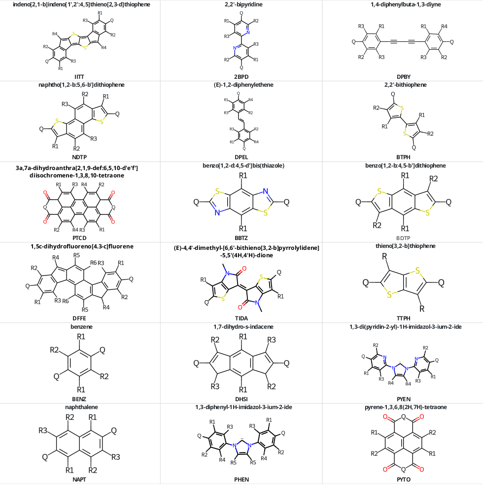
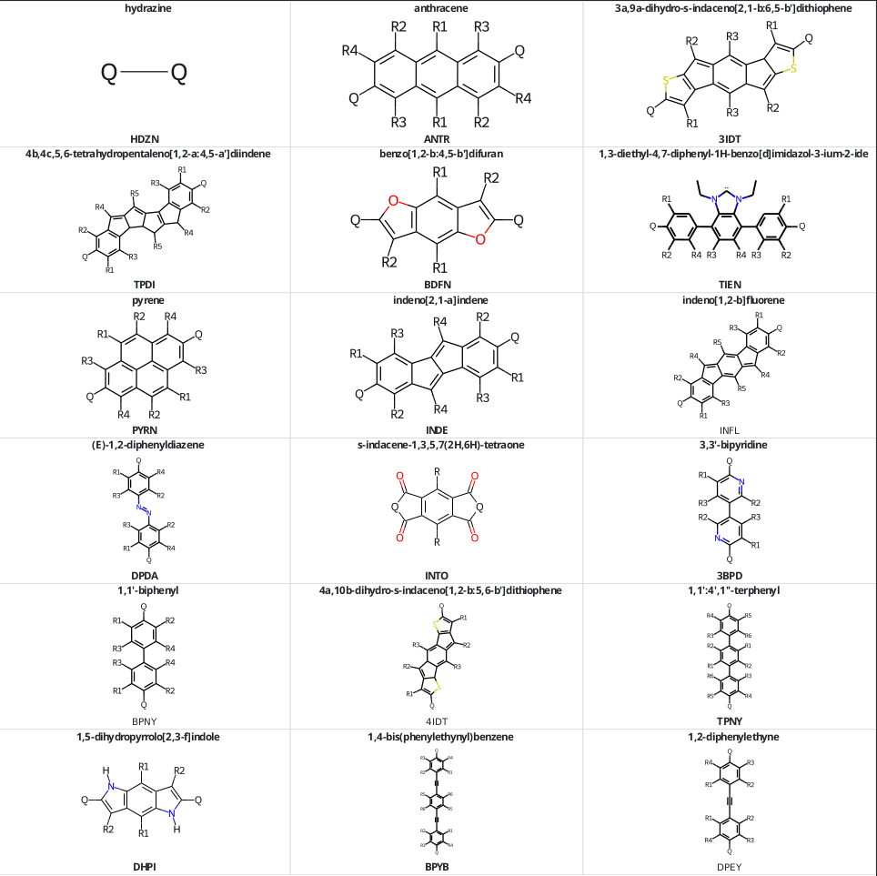
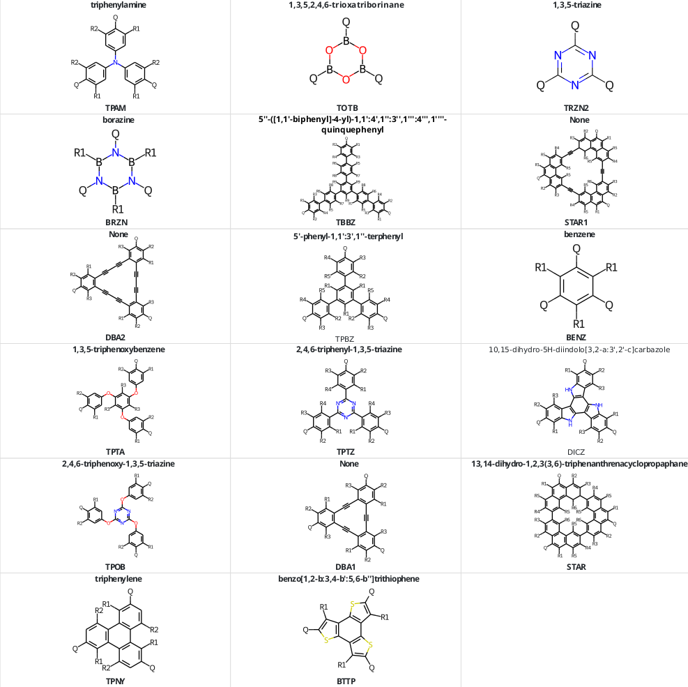
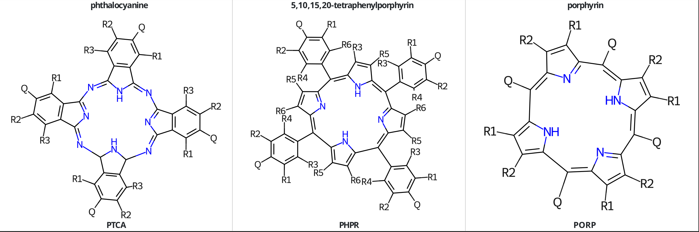
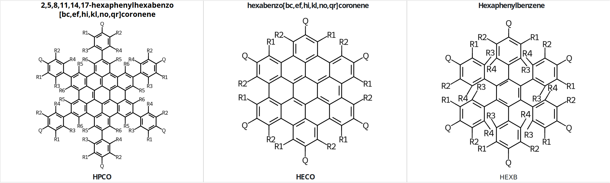
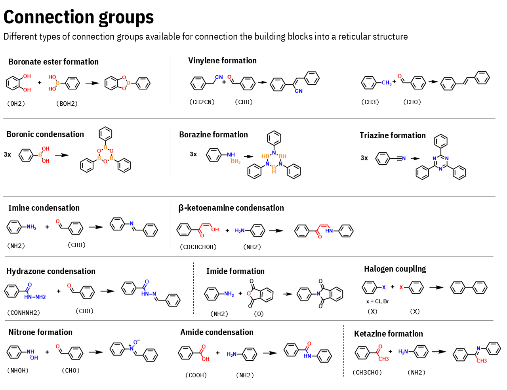
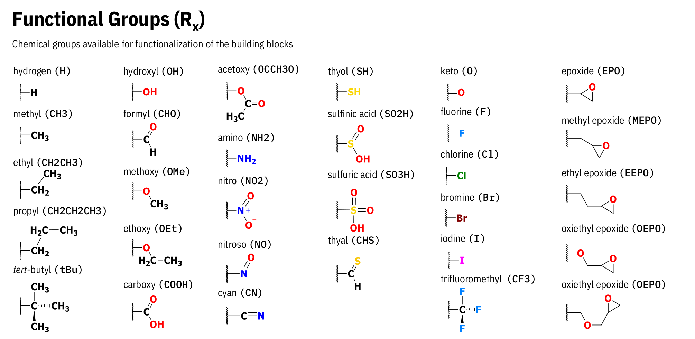

# pyCOFBuilder


[](https://pypi.python.org/pypi/pycofbuilder/)
[](https://pypi.python.org/pypi/pycofbuilder)
[](https://pypi.org/project/pycofbuilder)
[](https://GitHub.com/lipelopesoliveira/pycofbuilder/releases/)
[](https://arxiv.org/abs/2310.14822)
[](https://github.com/lipelopesoliveira/pycofbuilder/blob/master/LICENSE)

# What is pyCOFBuilder?

**pyCOFBuilder** is a simple and powerful python package to automatically assembly COF structures with specifics building blocks, topologies, and functionalizations following the reticular approach to build and represent COF structures. The project was developed to address the need for generation of COFs structures in a high-throughput style, based on a nomenclature tha allows direct sctructural feature interpretation from a simple name. The package uses [pymatgen](https://pymatgen.org/) to create the structures.

This package is still under development and, but it is already possible to create a large number of COFs structures.

Learn more at the [Documentation](https://lipelopesoliveira.github.io/pyCOFBuilder/index.html)

## Requirements

0. Python >= 3.10
1. pymatgen >= 2022.0.0
2. numpy >= 1.2
3. scipy >= 1.6.3
4. simplejson
5. ase
6. gemmi

The Python dependencies are most easily satisfied using a conda
([anaconda](https://www.anaconda.com/distribution)/[miniconda](https://docs.conda.io/en/latest/miniconda.html))
installation by running

```Shell
conda env create --file environment.yml
```

## Installation

You can install pyCOFBuilder using pip:

```Shell
pip install pycofbuilder
```

Alternativelly, you can use pyCOFBuilder by manually import it using the `sys` module, as exemplified below:

```python
# importing module
import sys
 
# appending a path
sys.path.append('{PATH_TO_PYCOFBUILDER}/pyCOFBuilder/src')

import pycofbuilder as pcb
```

Just remember to change the `{PATH_TO_PYCOFBUILDER}` to the directory where you download the pyCOFBuilder package.

## Basic Usage

To create a specific COF, such as `T3_BENZ_NH2_OH-L2_BENZ_CHO_H-HCB_A-AA`:

```python
# importing module
import sys
 
# appending a path
sys.path.append('{PATH_TO_PYCOFBUILDER}/pyCOFBuilder/src')

import pycofbuilder as pcb

cof = pcb.Framework('T3_BENZ_CHO_OH-L2_BENZ_NH2_H-HCB_A-AA')
cof.save(fmt='cif', supercell = [1, 1, 2], save_dir = '.')
```

You should see an output such as:

```python
T3_BENZ_NH2_OH-L2_BENZ_CHO_H_H-HCB_A-AA                       hexagonal   P    P6/m # 175    12 sym. op.
```

A `.cif` file (the default save format is CIF, but it can be easily changed by setting other value on the `fmt` option) will be created in the `out` folder. The code will print out some information about the structure created.

Currently, it is possible to select the following formats:

- `cif`
- `xsf`
- `pdb`
- `cjson`
- `vasp`
- `turbomole`
- `pqr`
- `qe`
- `gjf`
- `xyz`
  
Besides, the variable `structure` now is a `Framework` object. This object has some attributes that can be accessed:

```python
>>> cof.name
'T3_BENZ_NH2_OH-L2_BENZ_CHO_H-HCB_A-AA'
>>> cof.smiles
'(N)C1=C(O)C((N))=C(O)C((N))=C1O.(C([H])=O)C1=C([H])C([H])=C((C([H])=O))C([H])=C1[H]'
>>> cof.lattice
array([[ 22.49540055,   0.        ,   0.        ],
       [-11.24770028,  19.48158835,   0.        ],
       [  0.        ,   0.        ,   3.6       ]])
>>> cof.n_atoms
72
>>> cof.space_group
'P6/m'
```

## COFs and Building Blocks nomenclature

In order to ensure greater reproducibility as well as quickly and easily access to relevant information from the COFs, I've developed a simple nomenclature to name the structure. Generally speaking, a COF can be described as

### `Building_Block_1`-`Building_Block_2`-`Net`-`Stacking`

where:

- `Building_Block_1`: The building block with the greater connectivity.
- `Building_Block_2`: The building block with the smaller connectivity.
- `Net`: The net describing the reticular structure.
- `Stacking`: The stacking (for 2D structures) or interpenetrating degree (for 3D structures)

To name the building blocks I also developed a set of rules. The building block can be described as

### `Symmetry`\_`Core`\_`Connector`\_`RadicalGroupR1`\_`RadicalGroupR2`\_`RadicalGroupR3`\_`...`

where:

- `Symmetry`: The general symmetry of the building block. Also represents the connectivity of the building block. For 2D building blocks can be `L2`, `T3` or `S4`, and for 3D building blocks can be `D4`.
- `Core`: The 4 letters code referring to the building block core.
- `Connector`: The type of functional group that will be used to assembly the COF structure. Ex.: `NH2`, `CHO`, `CONHNH2`, etc.
- `RadicalGroupRN`: The Nth radical group in the structure. The number of Radical groups will change according to the availability of the core.

Note that every "card" for the building block name is separated by an underline (\_) and every "card" for the COF name is separated by a dash (-). This makes it easy to split the COF name into useful information.

## Current available Building Blocks







## Current available Connector Groups



## Current available R Groups



## Citation

If you find **pyCOFBuilder** useful in your research please consider citing the following paper:

> F. L. Oliveira and P. M. Esteves,
> _pyCOFBuilder: A python package for automated creation of Covalent Organic Framework models based on the reticular approach_
>
> _arxiv.org/abs/2310.14822_ [DOI](https://doi.org/10.48550/arXiv.2310.14822)
