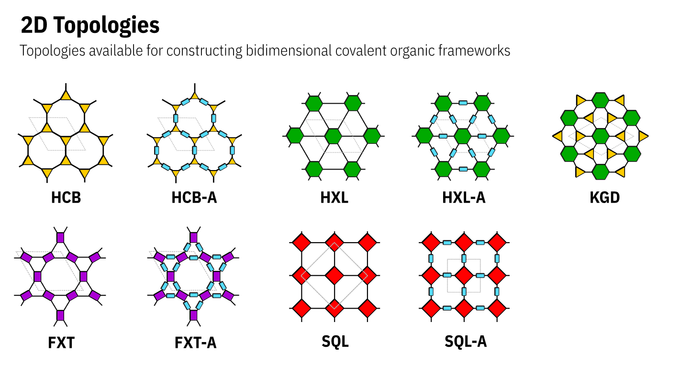

COFs and Building Blocks nomenclature
=====================================

COF nomenclature
----------------

In order to ensure greater reproducibility as well as quickly and easily access to relevant information from the COFs, I've developed a simple nomenclature to name this structures. 
Generally speaking, a COF can be described as building blocks connected by covalent bonds following a underlying net and presenting a specific stacking pattern/interpenetration degree. 
In this way, the COF name is represented as

``BuildingBlock1-BuildingBlock2-Net-Stacking``

pyCOFBuilder expects the COF name to be in this fixed format, with each of these characterists represented by "cards" separated by a dash (``-``). The "cards" are described as follows:

- ``BuildingBlock1``: The building block with the greater connectivity.
- ``BuildingBlock2``: The building block with the smaller connectivity.
- ``Net``: The net describing the reticular structure.
- ``Stacking``: The stacking (for 2D structures) or interpenetrating degree (for 3D structures)

Building blocks
---------------

To name the building blocks we also developed a set of rules. The building block can be described as

``Symmetry_Core_Connector_FunctionalGroupR1_FunctionalGroupR2_FunctionalGroupR3_...``

where:

- ``Symmetry``: The general symmetry of the building block. Also represents the connectivity of the building block. For 2D building blocks can be ``L2``, ``T3`` or ``S4``, and ``H6``.
- ``Core``: The 4 letters code referring to the building block core.
- ``Connector``: The type of functional group that will be used to assembly the COF structure. Ex.: ``NH2``, ``CHO``, ``CONHNH2``, etc.
- ``FunctionalGroupRN``: The Nth functional group in the structure. The number of Functional groups will change according to the availability of the core.

Note that every "card" for the building block name is separated by an underline (``_``) and every "card" for the COF name is separated by a dash (``-``). 
This makes it easy to split the COF name into useful information.

Symmetry
~~~~~~~~

The symmetry of the building block is represented by a code composed of a letter and a number. The letter represents the geometric 
figure of the building block and the number represents the connectivity of the building block. The table below shows the symbols,
connectivity numbers, and geometric figures used to represent the building blocks. *Please note that not all elements of the table are
currently implemented in pyCOFBuilder.*

.. list-table:: Symbols, connectivity numbers, and geometric figures used to represent the building blocks.
   :widths: 25 25 50
   :header-rows: 1

   * - Symbol
     - Connectivity
     - Geometric Figure
   * - L
     - 2
     - Line
   * - T
     - 3
     - Triangle
   * - S
     - 4
     - Square
   * - R
     - 4
     - Rectangle
   * - T
     - 4
     - Tetrahedron
   * - O
     - 6
     - Octahedron
   * - P
     - 6
     - Trigonal prism
   * - H
     - 6
     - Hexagon
   * - C
     - 8
     - Cube
   * - A
     - 8
     - Square antiprism
   * - E
     - 8
     - Octagon
   * - B
     - 12
     - Cuboctahedron
   * - I
     - 12
     - Icosahedron
   * - U
     - 12
     - Truncated tetrahedron
   * - X
     - 12
     - Hexagon prism

Organic Cores
~~~~~~~~~~~~~

Nets
----

The nets are described a three letter code representing the underlying net. The augmented nets are represented by the three letter code followed by a ``_A``. The nets are described as below

Stacking / Interpenetration
---------------------------

