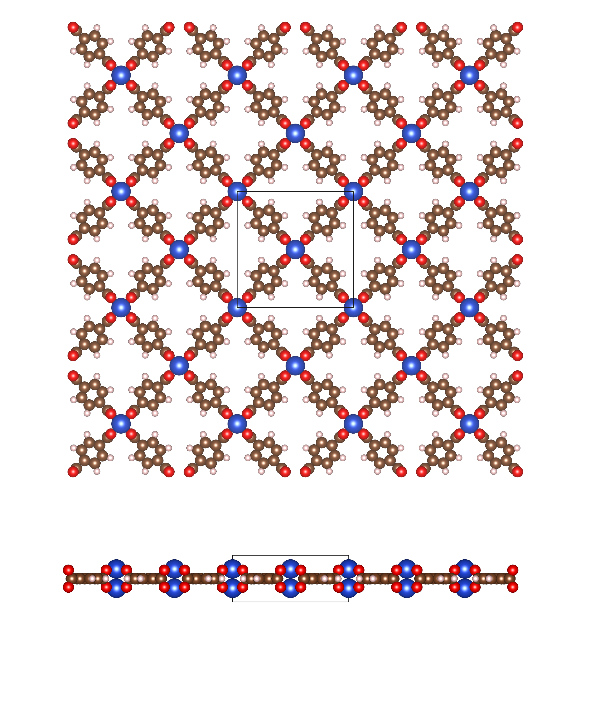

Generating MOF structures with pyCOFBuilder
===========================================

It is possible to generate MOF structures with pyCOFBuilder using the secondary building unit approach (SBU). 
Within this approach, the user can define the SBU and the linker, and the code will generate the MOF structure. Currently, there is only a limited number of SBUs for MOF generation, 
however we are working on expanding the library.

All the MOF SBUs can be connected to the linker through the formation of carbon-carbon bonds, which can be achieved by selecting `Br` or `Cl` connection groups. 

For example, the code below generates a MOF structure with a CuBTC SBU and a terephthalic acid linker.

.. code-block:: python
   :linenos:
    
   import pycofbuilder import pcb

    mof = pcb.Framework('S4_CuBTC_Br-L2_BENZ_Br_H-SQL_A-AA',
                    save_bb=False,
                    log_level='info',
                    log_format='simple',
                    dist_threshold=0.1,
                    symm_tol=0.2,
                    angle_tol=5)

    mof.save(fmt='cjson', supercell=[1, 1, 1], primitive=False)
    mof.save(fmt='cif', supercell=[1, 1, 1], primitive=False)

    >>> S4_CuBTC_Br-L2_BENZ_Br_H_H-SQL_A-AA                           tetragonal  P    P4/mmm # 123    16 sym. op.

The generated MOF structure can be visualized using VESTA or any other visualization software:

In the same way that COFs, MOFs can also be genarated with different stacking patterns of interpenetatred degree.

If you are interested in creating a MOF structure with a different SBU, please let us know and we will be happy to help you.